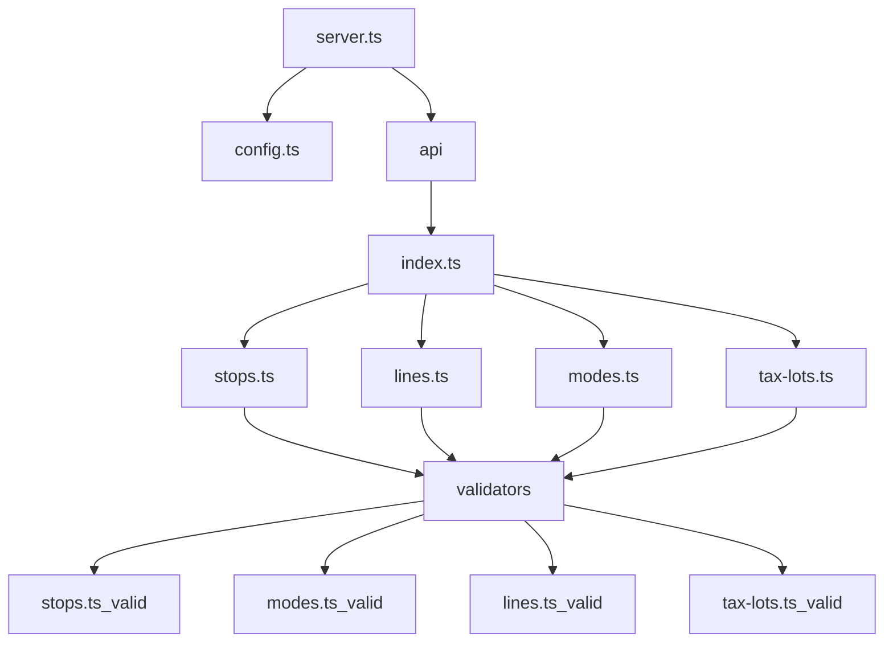

# Implémentation de l'API

L'API est implémenté dans le dossier [backend](../../backend). La source pour le code se trouve dans le dossier [backend/src](../../backend/src). 
## Fichiers de configuration
Dans le dossier principal se trouvent les fichiers suivants qui servent à faire fonctionner l'application:
1. Dockerfile: contient les configurations pour le docker qui permet de rouler l'ensemble de l'application. Certaines modifications ont été faites pour permettre de débugger dans docker en exposant le port 9229 pour le debugger.
2. nodemon.json: contient la configuration de nodemon qui permet de faire le hot-restart voulant dire que l'application est recompilée dans l'instance docker chaque fois qu'un fichier est sauvegardé. d'autre part, l'utilisation du tag --inspect 0.0.0.0:9229 permet de mettre en place le debug. Le fichier [launch.json](../../.vscode/launch.json) permet à visual studio d'accéder au débuggage
3. tsconfig.json: contient les paramètres utilisés pour typescript
4. package.json: donne les dépendances à d'autres librairies, le point d'entrée du script (server.ts)[../server.ts]

## Architecture du backend

Le backend est structuré selon le graphique suivant.

### [server.ts](../../backend/src/api/server.ts)
Tel qu'indiqué dans le package.json, server.ts est le point d'entrée dans le backend. C'est la qu'on créé le router pour l'api (en apellant à createApiRouter qui est localisé [ici](../../backend/src/api/routes/index.ts)) qui dispatche ensuite les requêtes selon l'appel spécifique (lignes, modes, arrets, lots cadastraux). D'autre part, le fichier server.ts va chercher le fichier config. Ce fichier est utilisé pour extraire l'information nécessaire à la connexion à la base de données.

### [config.ts](../../backend/src/api/config.ts)
Ce fichier lit le fichier env qui doit se situer à la racine du projet et doit contenir les valeurs suivantes spécifiques à votre implémentation de base de données:
```
DB_USER = "postgres"
DB_HOST = "localhost"
DB_NAME = "nom_db"
DB_PASSWORD = "entrez votre mdp"
DB_PORT = "5432"
SERVER_PORT = "5000"
```
Ce fichier requiert l'utilisation de la librairie dotenv

