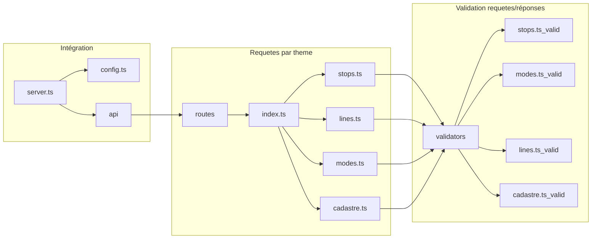

# Implémentation de l'API
[Retour au README.md](../../README.md)

L'API est implémenté dans le dossier [backend](../../backend). La source pour le code se trouve dans le dossier [backend/src](../../backend/src). 
## Fichiers de configuration
Dans le dossier principal se trouvent les fichiers suivants qui servent à faire fonctionner l'application:
1. Dockerfile: contient les configurations pour le docker qui permet de rouler l'ensemble de l'application. Certaines modifications ont été faites pour permettre de débugger dans docker en exposant le port 9229 pour le debugger.
2. nodemon.json: contient la configuration de nodemon qui permet de faire le hot-restart voulant dire que l'application est recompilée dans l'instance docker chaque fois qu'un fichier est sauvegardé. d'autre part, l'utilisation du tag --inspect 0.0.0.0:9229 permet de mettre en place le debug. Le fichier [launch.json](../../.vscode/launch.json) permet à visual studio d'accéder au débuggage
3. tsconfig.json: contient les paramètres utilisés pour typescript
4. package.json: donne les dépendances à d'autres librairies, le point d'entrée du script (server.ts)[../server.ts]

## Architecture du backend

Le backend est structuré selon le graphique suivant. En réalité, les fonctions de validation sont parfois implémentées directement dans la fonction de l'API ce qui n'est pas une bonne pratique mais est arrivé au fil du temps du fait de l'utilsiation de l'IA générative qui n'était pas nécessairement contrainte. D'autre part la compréhension limité des auteurs en début de projet.

### [server.ts](../../backend/src/server.ts)
Tel qu'indiqué dans le package.json, server.ts est le point d'entrée dans le backend. C'est la qu'on créé le router pour l'api (en apellant à createApiRouter qui est localisé [ici](../../backend/src/api/routes/index.ts)) qui dispatche ensuite les requêtes selon l'appel spécifique (lignes, modes, arrets, lots cadastraux). D'autre part, le fichier server.ts va chercher le fichier config. Ce fichier est utilisé pour extraire l'information nécessaire à la connexion à la base de données.

### [config.ts](../../backend/src/config.ts)
Ce fichier lit le fichier env qui doit se situer à la racine du projet et doit contenir les valeurs suivantes spécifiques à votre implémentation de base de données:
```
DB_USER = "postgres"
DB_HOST = "localhost"
DB_NAME = "nom_db"
DB_PASSWORD = "entrez votre mdp"
DB_PORT = "5432"
SERVER_PORT = "5000"
```
Ce fichier requiert l'utilisation de la librairie dotenv

### [api/routes/index.ts](../../backend/src/api/routes/index.ts)
routes est le point d'entrée du coeur de l'API. Il permet d'acheminer les requêtes vers différents fichiers (lines.ts,stops.ts). Le code est donc très simple avec seulement des commandes d'acheminement en utilisant les librairies express et pg. Un pool pg doit être fourni en entrée à la fonction create qui permet la connection à la base de données tandis que la librairie express permet de faire circulers les requêtes aux différents fichiers en fonction du chemin fourni par le client pour la requête.
### Routes
Encore une fois, les librairies pg et express sont utilisées. D'autre part, la librairie express fournit un type requesthandler, Request et Response qui permettent de gérer le corps de requetes d'API. L'ensemble des fonctions utilisent une résolution asynchrone avec des Promisepour permettre au reste du code du frontend de fonctionner pendant que les requêtes complètent.
### [api/routes/lines.ts](../../backend/src/api/routes/lines.ts)
Il est ausiLe fichier contient 5 sous fonctions à la fonction principale createLinesRouter qui permettent de compléter les différentes opérations requises:
- getAllLines: /GET va chercher l'information de toutes les lignes
- getLine: /GET va chercher une ligne spécifiquement
- createLine: /POST crée une ligne avec les données dans le corps et l'identifiant de ligne dans l'URL
- updateLine: /PUT met à jour une ligne avec les données dans le corps et l'identifiant de ligne dans l'URL
- getAllRoutePoints: /GET va chercher la table qui contient l'ordre des stations dans toutes les lignes
- getRoutePoints: /GET va chercher la table qui contient l'ordre des stations pour une ligne
- addRoutePoints: /POST créer une nouvelle entrée dans la table pour l'ordre des stations
- updateRoutePoint: /PUT met à jour un élément dans la table d'ordre des stations.
- deleteRoutepoints: /DELETE supprime une entrée dans la table d'ordre des stations.
- deleteLine: /DELETE supprime une ligne. 
- getLineCosts: /GET calcule les coûts d'une ligne de transport avec une requête SQL.

Il est important de noter que la fonction create ne gère pas la mise à jour des index des autres arrets dans la ligne qui doit donc être gérée dans le front end. Ceci n'est probablement pas l'implémentation la plus robuse. Une implémentation future donnant l'identifiant des autres points de routages dont les index doivent être incrémentés serait pertinente.
### [api/validators/lines.ts](../../backend/src/api/validators/lines.ts)
Ce fichier contient une fonction de validation des entrées pour une ligne. Elle n'a pas été complétée pour les types successifs qui se sont ajoutés au fil du temps (couleur par exemple). Dautre part, aucune validation n'est faite pour les line_stops (point de routage) de la ligne de transport en commun.

### [api/routes/stops.ts](../../backend/src/api/routes/stops.ts)
Ce fichier permet de faire des opérations sur la base de données pour les arrêts. Malheureusement, l'implémentation de la validation devrait être faite dans la fonction de validation. Les fonctions suivantes sont implémentées pour les arrêts;
 - getAllStops: /GET va chercher l'ensemble des arrets
 - getStop: /GET qui va cherche un arrêt spécifié dans l'URL
 - createStop: /POST qui crée un nouvel arret
 - updateStop: /PUT qui met à jour l'arrêt spécifié dans l'URL
 - deleteStop: /DELETE permet de supprimer un arret
