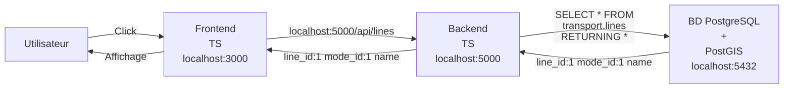

# Architecture
## Introduction et schéma de base
L'architecture du site est relativement conventionnelle avec un frontend qui gère l'interface avec l'utilisateur, affiche les réseaux de transport et permet à l'utilisateur de modifier les données. La segmentation entre le frontend et le backend permet de séparer les fonctions, facilitant le développement et permettant de réutiliser le backend pour d'autres utilisations ou par d'autres site web si le point d'entrée est exposé au public. 

## Front end
Le front end est une application REACT. REACT est un module de javascript qui permet de créer des applications dynamiques qui peuvent s'adapter au contexte et générer des block HTML réutilisés par l'index.hmtl qui est le point d'entrée du site web. Les détails du frontend sont donnés [ici](../frontend/frontend_doc.md). Le frontend utilise aussi le module axios pour envoyer des requêtes au backend.

## Back end
Le backend gère la plupart des calculs et insertions de données dans la base de données. Il utilise le module express pour gérer la diffusion des requêtes aux bonne fonctions et pour les types pertinents. Le module pg est utilisé pour envoyer les requêtes SQL au serveur et recevoir les réponse. La documentation pour le backend est disponible [ici](../api/API%20implementation.md).
