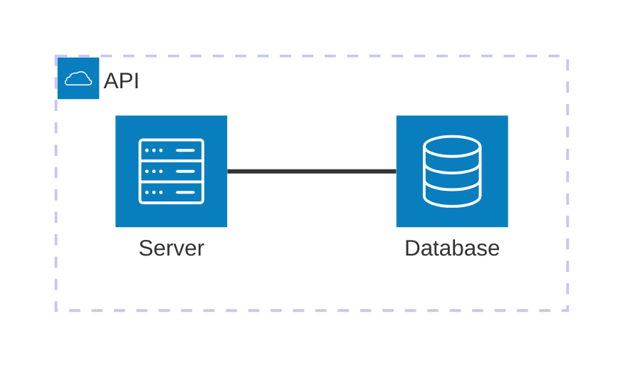

# Architecture

L'architecture du site est relativement conventionnelle avec un frontend qui gère l'interface avec l'utilisateur, affiche les réseaux de transport et permet 

```mermaid
architecture-beta
    group api(cloud)[API]
        service server(server)[Server] in api
    service db(database)[Database] in api


    db:L -- R:server
```
