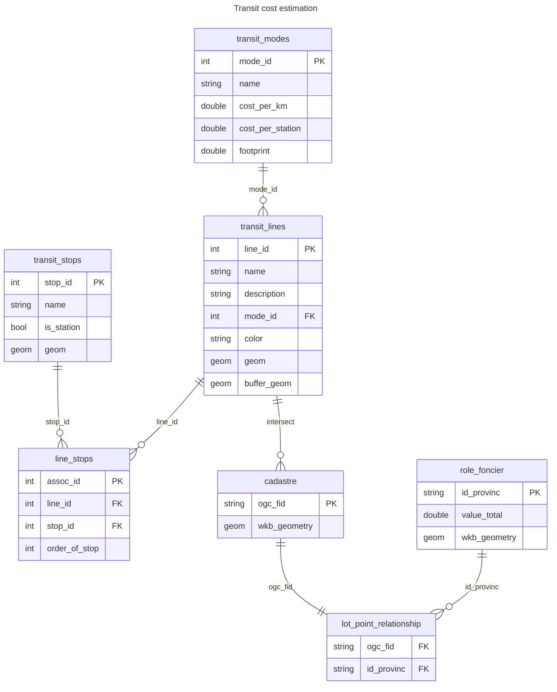

# Structure de la base de données 
[Retour au README.md](../../README.md)
## Diagramme Entité Relation (Entity Relation Diagram)
Le diagramme d'entité relation simplifié ci-dessous explique les principaux champs utiles pour le calcul des coûts d'infrastructure:

Les sections suivantes détailleront les champs de la base de données, ainsi que certains modifications en termes de clés, de fonctions déclenchées qui doivent être mises en place pour que la géométrie des lignes et des zones tampons des lignes soient mises à jour avec les modifications sur les champs qui affecte le tracé et les zones tampons.

## Sauvegarde de la structure de la base de données:
Une [sauvegarde de la structure](../../sql_reference/database_structure_backup.sql) de la base de données a été complétée pour permettre de rapidement mettre en place la base de données au besoin avec une quantité limitée de données. Il est important de noter que certains schémas de la sauvegarde devront potentiellement être supprimés avant que les données issues de géoindex ou de la chaire soient réimportés pour le cadastre et le rôle foncier. Les trigger functions sont aussi déjà implémentés dans le fichier de sauvegarde évitant de devoir refaire le travail manuellement.

## transit_modes
transit_modes contient l'information sur les modes de transport. Ces derniers sont modifiables par l'utilisateur pour permettre la création de différents modes de transport selon les besoins et à mesure que des nouvelles données apparaissent. Les champs de la table sont décrits dans le tableau ci-dessous:
| champs | type | Clé | description|
|--------|------|------|------|
| mode_id |entier serial | PK |identifiant unique du mode. Initialement instancié comme serial, une séquence de la base de données incrémente cette valeur à chaque nouvelle insertion dans la table|
| name | caractère variant 255 | | nom du mode de transport
|cost_per_km| double| |Coût par kilomètre linéaire d'infrastructure. Cette valeur est multiplié par la longueur du tracé dans la colonne geom de la table transit_lines pour obtenir un coût par km|
|cost_per_station |double | |Coût par station. Les stations peuvent être un vecteur important pour les surcouts dans les projets de transport. Cependant, le désir de rendre le modèle de prévision trop complexe prend le risque de s'éloigner de la prévision par classe de référence qui vise au maximum à simplifier le modèle initial qui pourrait augmenter les biais|
|footprint| double| | [Empreinte au sol en mètres pour l'infrastructure linéaire](../transit-infrastructure-costs/cost_estimation_review.md)

## transit_stops
La table transit_stops contient les données sur les stations et les points de contrôle du tracé de la ligne. La table suivante donne une description des champs de la table:

|Champs | Type | Clé |Description |
|-------|------|-----|------------|
| stop_id | entier serial | PK | Identifiant unique pour l'arrêt de TC|
| is_station| booléen | | Décrit si ce point est un arrêt ou simplement un point de contrôle pour altérer la ligne |
| geom | geometry | |Emplacement 2D de la station entrposé sous forme de WKB en crs 3857|

## transit_lines
La table transit_lines énumère les lignes de transport utilisées dans l'application.  Les champs sont énumérés dans la table suivante:
|Champs | Type | Clé |Description |
|-------|------|-----|------------|
| line_id | entier serial | PK | Identifiant unique pour une ligne de transport|
| name | caractère variant 255 |  | nom de la ligne de transport |
| description | caractère variant 255 | | Description de la ligne |
| mode_id | entier | FK | Identifiant du mode issue de transit_modes qui est à utiliser pour la ligne de transport |
| color | caractère variant 255 | | couleur en hexadécimal à utiliser pour la ligne dans les cartes |
| geom |geometry - LineString | | Géométrie linéaire de la ligne - Recalculé automoatiquement à chaque modification du tracé à l'aide de fonctions trigger|
| buffer_geom | geometry - Polygone | | Géométrie du buffer utilisé pour l'infrastructure, utilisé pour trouver les lots à exproprier - Recalculé automoatiquement à chaque modification du tracé à l'aide de fonctions trigger ou du mode et de son empreinte|

## line_stops
line_stops est la table qui permet d'utiliser les stations et les points de contrôle pour formuler la géométrie de la ligne. 
|Champs | Type | Clé |Description |
|-------|------|-----|------------|
| assoc_id | entier serial | PK | Identifiant unique pour l'association|
| line_id | entier | FK | Identifiant de la ligne dont on altère le tracé|
| stop_id | entier | FK | Identifiant de l'arrêt |
| order_of_stop| entier | | Ordonancement de l'arrêt dans la ligne |
### Example
Prenons la ligne dont l'identificant est line_id = 1. Le premier arrêt de cette ligne a l'identifiant 1, le deuxième 3, le troisième 4, le quatrième 12. Les entrées dans la table pour définir cette ligne seraient les suivantes. Les assoc_id n'ont pas été assignés puisque ces derniers pourraient varier dépendant de l'historique de la BD.
|assoc_id | line_id | stop_id |order_of_stop |
|-------|------|-----|------------|
| XX | 1 | 1 | 1|
| XX | 1 | 3 | 2|
| XX | 1 | 4 | 3 |
| XX | 1 | 12 | 4 |
## cadastre
La table du cadastre reproduit les champs issus du fichier tiré de géo-index. Seuils ceux qui sont utilisés sont discuté à des fins de clarté. La plupart des champs ne sont pas particulièrement utiles, même dans un autre contexte:
|Champs | Type | Clé |Description |
|-------|------|-----|------------|
| ogc_fid | entier serial | PK | Identifiant du lot|
| wkb_geometry | geometry - MultiPolygon |  | Géométrie du lot|
| c.va_suprf_l | numeric |  | Superficie du lot utilisée pour trouver la proportion du lot à exproprier pour les lots de plus de 5000m2|

## role_foncier

Le rôle foncier est une base de données donnant les valeurs foncières et certaines caractéristiques géométriques des bâtiments. Une version modifiée du rôle foncier a été utilisée qui a été fournie par la chaire mobilité. Cette version a déplacé lespoints du centre géométrique à la porte d'entrée. Pour assurer que le rôle foncier puisse directement utilisé dans une version future. Les principaux champs sont listés ci-dessous d'autre existent au rôle foncier Ministère des Affaires Municipales et de l’Habitation. (2024).
| Champs CM | Champs Original | Type | Clé |Description |
|-------|----|--|-----|------------|
| id_provinc | id_provinc |caractère variant | PK | Identifiant du |
| date_entree | RL0201Gx | entier | |date initial d'inscription au rôle du propriétaire concerneé|
| anrole | RLM02A | entier | |Date du rôle foncier considéré.|
| code_utilisation | RL0105A | entier | | Code de l’utilisation prédominante de l’unité d’évaluation |
| code_mun | RLM01A | entier | | Code de la municipalité |
| land_width_m | RL0301A| réel | | Dimension linéaire du terrain en front sur la voie publique  |
| land_area_sq_m | RL0302A | réel | | Superficie du terrain porté au rôle|
| code_lien_physique | RL0309A| caractère | | Code du lien physique de l’unité d’évaluation lorsqu’il existe un seul bâtiment principal |
| building_flats |RL0311A| entier | | Nombre total de logements de l’unité d’évaluation|
| building_rental_rooms |RL0312A| entier | | Nombre total de chambres locatives de l’unité d’évaluation|
|building_non_flats_spaces | RL0313A| entier | | Nombre total de locaux non résidentiels de l’unité d’évaluation|
| value_land | RL0402A | entier | | Valeur du terrain inscrite au rôle en vigueur|
| value_building | RL0403A| entier | | Valeur du ou des bâtiments inscrite au rôle en vigueur|
| value_total | RL0404A| entier | | Valeur de l’immeuble inscrite au rôle en vigueur|

## lot_point_relationship
Cette table est une jointure spatiale. Bien que cette jointure peut être formulée pour être performée régulièrement. Elle est demandante. D'autre part, les données du rôle foncier et du cadastre changent rarement et il est donc pertinent de faire la jointure spatiale une fois, d'en enregistrer le résultat qui est plus rapide à accéder. La requête SQL pour créer cette table est donnée ci-dessous:
```
CREATE TABLE transport.lot_point_relationship AS
SELECT 
    c.ogc_fid AS lot_id,
    r.id_provinc AS role_foncier_id
FROM cadastre.cadastre_quebec c
JOIN foncier.role_foncier r
    ON ST_Intersects(c.wkb_geometry, r.geog::geometry);
```
# Bibliographie
Ministère des Affaires Municipales et de l’Habitation. (2024). Rôles d’évaluation foncière du Québec—Rôles d’évaluation foncière du Québec géoréférencés 2024—Données Québec [Dataset]. https://www.donneesquebec.ca/recherche/dataset/roles-d-evaluation-fonciere-du-quebec/resource/fe31dfcd-0753-4769-9868-d897d9c5a0ba

