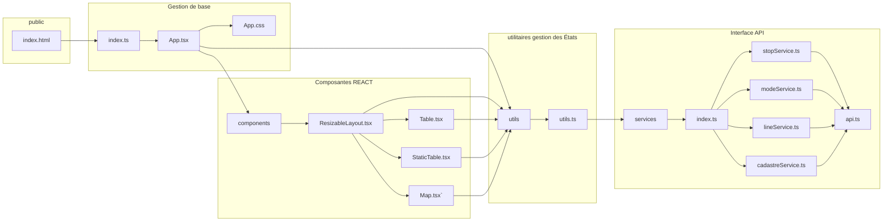

# Frontend
Le frontend est l'application qui permet à l'utilisateur de visualiser les résultats et de définir les intrants nécessaires pour calculer les coûts. L'utilisateur doit définir les géométries des lignes, les couts par km des infrastructures en fonction du mode, ainsi que l'empreinte au sol du mode pour trouver les propriétés qui devront potentiellement être expropriées. La figure suivante donne un aperçu de l'architecture du frontend


## États de l'application utilisés dans l'entièreté de l'application
Plusieurs états permettent à l'application de mettre à jour les géométries et tables requises pour faire fonctionner l'interface. Chaque état se voit attribuer une fonction de remise à jour. 
### États des variables pertinentes
Les états suivants sont utilisés pour gérer les données reliées à ce qu'on essaie de calculer
- transitStops, setTransitStops: est la variable d'état qui contient les arrêts
- transitLines, setTransitLines: est la variable d'état qui contient les données sur les lignes de transport
- transportModes, setTransportModes: est la variable d'état qui contient les données sur les modes de transport
- lineStops, setLineStops: est la variable d'état qui contient les données sur l'ordonnancement des arrêts
- lineCosts, setLineCosts: est la variable d'état contenant les couts des lignes de transports

### États des variables de l'interface utilisateur
À ces dernières s'ajoutent des interfaces qui servent à gérer l'interface utilisateur, avec leur fonction de changement
- loading, setLoading: variable qui permet de temporiser l'interface pendant le téléchargement de données initial
- error,setError: variable qui permet de créer un erreur qui efface l'interface pendant le chargmenet initial
- editingItem,setEditingItem: tuple de table et id qui permet de déterminer quelle table et quel item sont en train d'être mis à jour
- selectedLine,setSelectedLine: nombre qui dénomine quelle ligne on modifie en éditant la table linestops
- newItemCreation,setNewItemCreation: état qui change les boutons lorqu'un élément est en train d'être créé

## Fonctions d'utililtaires
Les fonctions d'utililitaires gèrent la majeure partie de la logique en termes de modifications des diverses tables de données. La liste suivante donne un survol:
- handleChange: gère le changement de valeurs dans les différents objets et met à jour les états locaux lorsqu'on modifie l'item
- handleAdd: gère la création de nouveaux éléments dans les états
- handleEdit: gère l'état editing item pour changer l'état lorsqu'un bouton edit est cliqué et sauvegarde l'item original pour pouvoir cliquer le bouton cancel
- handleCancel: remet l'état local à l'état initial
- handleSave: gère la sauvegarde des données modifiées en utilisant les services
- createMapHandlers: créé des handlers pour la portion cartographique
En plus de la gestion de données, des fonctions anciliaires sont gérées par le dossier utils:
- calculateNewOrder: calcule l'ordre des arrêts lorsqu'un nouvel arrêt est ajouté dans une ligne. Cette modification est gérée dans le frontend. En théorie, faire cette gestion dans le backend serait plus robuste pour permettre de gérer plusieurs personnes connectées en même temps.
- getDefaultValues: met a disposition des valeurs lors de la création d'un nouvel item.
- wkbHexToPosition: permet de changer les données hexa décimales à des positions lisibles par leaflet
- getContrastColor: génère une couleur contrastée pour les dropdown list de couleurs

## Composants principaux

### ResizableLayout - Composant central de l'application
- Gère la mise en page adaptative (carte + panneau de configuration)
- Coordonne les interactions entre composants
- Implémente le système d'onglets pour différentes vues :
  - Transit Lines
  - Transport Modes
  - Transit Stops
  - Line Stops
  - Line Costs

### Map - Gestion cartographique
- Utilise React-Leaflet avec projection EPSG:3857
- Gère trois types d'éléments :
  - Marqueurs pour les arrêts (stations et points de passage)
  - Polylines pour les lignes de transport
  - Couches GeoJSON pour les zones cadastrales
- Implémente différents modes d'interaction :
  - Mode ajout d'arrêt avec curseur spécifique
  - Mode édition avec marqueurs déplaçables
  - Mode sélection pour l'ajout d'arrêts aux lignes

### Table & StaticTable - Gestion des données
- Table : Composant générique d'édition CRUD
- StaticTable : Version lecture seule pour coûts
- Système de colonnes configurable via COLUMN_MAPPINGS

## Gestion des types

### Types principaux
```typescript
interface TransitStop {
  id: number;
  name: string;
  position: Position;  // Coordonnées EPSG:3857
  isStation: boolean;
  isComplete: boolean;
}

interface TransitLine {
  id: number;
  name: string;
  description: string;
  mode_id: number;
  color: string;
}

interface TransportMode {
  id: number;
  name: string;
  costPerKm: number;
  costPerStation: number;
  footprint: number;
}

interface LineStop {
  id: number;
  line_id: number;
  stop_id: number;
  order_of_stop: number;
}
```

### Types de gestion d'état
```typescript
interface EditingItem {
  table: string;
  id: number | null;
}

interface InsertPosition {
  type: 'first' | 'last' | 'after';
  afterStopId?: number;
}
```

## Gestion des données

### Services API
L'application utilise plusieurs services spécialisés pour communiquer avec le backend.

#### Configuration de base (api.ts)
```typescript
// Configuration Axios avec intercepteurs
const api = axios.create({
  baseURL: `${process.env.REACT_APP_API_URL}/api`,
  headers: { 'Content-Type': 'application/json' }
});
```
- Intercepteurs pour logging des requêtes/réponses
- Gestion centralisée des erreurs
- Configuration du baseURL via variables d'environnement

#### Service des lignes (lineService)
```typescript
lineService = {
  // Gestion des lignes
  getAll: () => Promise<ApiLinesResponse>,              // Récupère toutes les lignes
  getById: (id: number) => Promise<ApiLineResponse>,    // Récupère une ligne
  create: (data: Omit<TransitLine, 'id'>) => Promise<ApiLineResponse>, 
  update: (id: number, data: Partial<TransitLine>) => Promise<ApiLineResponse>,
  delete: (id: number) => Promise<void>,

  // Gestion des arrêts sur une ligne
  getAllRoutePoints: () => Promise<ApiLineStopsResponse>,   // Tous les arrêts de toutes les lignes
  getRoutePoints: (id: number) => Promise<LineStop[]>,      // Arrêts d'une ligne
  addRoutePoint: (lineId: number, data: Omit<LineStop, 'id'>) => Promise<ApiLineStopResponse>,
  updateRoutePoints: (lineId: number, data: LineStop[]) => Promise<ApiLineStopsResponse>,
  deleteRoutePoint: (lineId: number, stopAssocId: number) => Promise<ApiLineStopResponse>,

  // Calculs de coûts
  getAllLineCosts: () => Promise<ApiLineCostsResponse>,     // Coûts pour toutes les lignes
  calculatePrice: (id: number) => Promise<void>             // Calcul pour une ligne
}
```
- Gestion CRUD complète des lignes de transport
- Gestion de l'association lignes-arrêts avec ordonnancement
- Calcul des coûts d'infrastructure et d'expropriation

#### Service des arrêts (stopService)
```typescript
stopService = {
  getAll: () => Promise<ApiStopsResponse>,
  getById: (id: number) => Promise<ApiStopResponse>,
  create: (data: Omit<TransitStop, 'id'>) => Promise<ApiStopResponse>,
  update: (id: number, data: Partial<TransitStop>) => Promise<ApiStopResponse>,
  delete: (id: number) => Promise<void>
}
```
- Transformation automatique des coordonnées EPSG:3857
- Gestion du statut station/point de passage
- Validation des données avant envoi

#### Service des modes (modeService)
```typescript
modeService = {
  getAll: () => Promise<ApiModesResponse>,
  getById: (id: number) => Promise<ApiModeResponse>,
  create: (data: Omit<TransportMode, 'id'>) => Promise<ApiModeResponse>,
  update: (id: number, data: Partial<TransportMode>) => Promise<ApiModeResponse>,
  delete: (id: number) => Promise<void>
}
```
- Gestion des coûts par kilomètre et par station
- Conversion camelCase (frontend) ↔ snake_case (backend)
- Transformation bidirectionnelle des données

#### Service cadastral (cadastreService)
```typescript
cadastreService = {
  getIntersections: (geometry: GeoJSON) => Promise<ApiCadastreIntersectionResponse>,
  getCadastreInBounds: (bounds: GeoJSON) => Promise<ApiCadastresResponse>,
  getRoleFoncierInBounds: (bounds: GeoJSON) => Promise<ApiRoleFonciersResponse>,
  getCadastreByIds: (ids: number[]) => Promise<ApiCadastresResponse>
}
```
- Gestion des données géospatiales (GeoJSON)
- Calcul des intersections avec les tracés
- Récupération des informations foncières

#### Service du rôle foncier (taxLotService)
```typescript
taxLotService = {
  getAll: () => Promise<TaxLot[]>,
  getById: (id: string) => Promise<TaxLot>,
  getNearLine: (lineId: number) => Promise<TaxLot[]>
}
```
- Récupération des informations fiscales
- Analyse des lots impactés par les lignes
- Calcul des coûts d'expropriation

### Gestion des coordonnées
Utilitaires de conversion entre systèmes de coordonnées :
```typescript
leafletToPosition: LatLng → Position (EPSG:3857)
positionToLeaflet: Position → LatLng
positionToGeoJSON: Position → [lng, lat]
geoJSONToPosition: [lng, lat] → Position
```

## Flux de données

### Ajout d'éléments
```typescript
handleAdd(table, data) → 
  1. Création état temporaire
  2. Mode édition
  3. Validation
  4. Sauvegarde API
  5. Mise à jour état local
```

### Suppression sécurisée
```typescript
handleDelete(table, id) →
  1. Vérification des dépendances
  2. Confirmation utilisateur
  3. Suppression API
  4. Mise à jour état local
```

### Gestion des modifications
- Modifications locales via le système d'état React
- Validation et persistence via les services API
- Utilisation de handleChange, handleSave, handleCancel

## Optimisations techniques

### Performance
- Chargement des données cadastrales à la demande
- Memorization des handlers fréquents
- Mise à jour sélective des états React
- 
### Sécurité des données
- Validation des entrées avant envoi API
- Vérification des dépendances avant suppression
- Gestion des sessions et autorisations

### Gestion d'erreurs
- Typage fort avec TypeScript
- Vérification des réponses API
- Retours utilisateur sur erreurs
