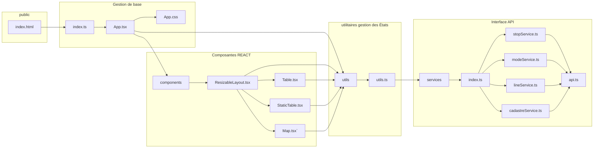

# Frontend
Le frontend est l'application qui permet de visualiser les résultats ainsi qu'à l'utilisateur de définir les intrants nécessaires pour calculer les coûts. Ces derniers doivent définir les géométries des lignes, les couts par km des infrastructures en fonction du mode, ainsi que l'empreinte au sol du mode pour trouver les propriétés qui devront potentiellement être expropriées. La figure suivante donne un aperçu de l'architecture du frontend

