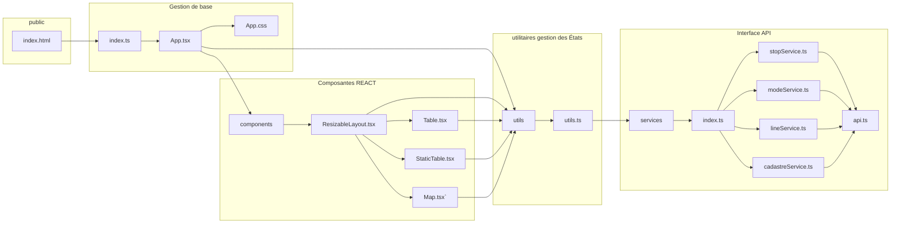

# Frontend
Le frontend est l'application qui permet de visualiser les résultats ainsi qu'à l'utilisateur de définir les intrants nécessaires pour calculer les coûts. Ces derniers doivent définir les géométries des lignes, les couts par km des infrastructures en fonction du mode, ainsi que l'empreinte au sol du mode pour trouver les propriétés qui devront potentiellement être expropriées. La figure suivante donne un aperçu de l'architecture du frontend

## États de l'application utilisés dans l'entièreté de l'application
Plusieurs états permettent à l'application de mettre à jour les géométries et tables requises pour faire fonctionner l'interface. Chaque état se voit attribuer une fonction de remise à jour. 
### États des variables pertinentes
Les états suivants sont utilisés pour gérer les données reliées à ce qu'on essaie de calculer
- transitStops, setTransitStops: est la variable d'état qui contient les arrêts
- transitLines, setTransitLines: est la variable d'état qui contient les données sur les lignes de transport
- transportModes, setTransportModes: est la variable d'état qui contient les données sur les modes de transport
- lineStops, setLineStops: est la variable d'état qui contient les données sur l'ordonnancement des arrêts
- lineCosts, setLineCosts: est la variable d'état contenant les couts des ligness de transports

### États des variables de l'interface utilisateur
À ces dernières s'ajoutent des interfaces qui servent à gérer l'interface utilisateur, avec leur fonction de changement
- loading, setLoading: variable qui permet de temporiser l'interface pendant le téléchargement de données initial
- error,setError: variable qui permet de créer un erreur qui efface l'interface pendant le chargmenet initial
- editingItem,setEditingItem: tuple de table et id qui permet de déterminer quelle table et quel item sont en train d'être mis à jour
- selectedLine,setSelectedLine: nombre qui dénomine quelle ligne on modifie en éditant la table linestops
- newItemCreation,setNewItemCreation: état qui change les boutons lorqu'un élément est en train d'être créé

## Fonctions d'utililtaires
Les fonctions d'utililitaires gèrent la majeure partie de la logique en termes de modifications des diverses tables de données. La liste suivante donne un survol:
- handleChange: gère le changement de valeurs dans les différents objets et met à jour les états locaux lorsqu'on modifie l'item
- handleAdd: gère la création de nouveaux éléments dans les états
- handleEdit: gère l'état editing item pour changer l'état lorsqu'un bouton edit est cliqué et sauvegarde l'item original pour pouvoir cliquer le bouton cancel
- handleCancel: remet l'état local à l'état initial
- handleSave: gère la sauvegarde des données modifiées en utilisant les services
- createMapHandlers: créé des handlers pour la portion cartographique
En plus de la gestion de données, des fonctions anciliaires sont gérées par le dossier utils:
- calculateNewOrder: calcule l'ordre des arrêts lorsqu'un nouvel arrêt est ajouté dans une ligne. Cette modification est gérée dans le frontend. En théorie, faire cette gestion dans le backend serait plus robuste pour permettre de gérer plusieurs personnes connectées en même temps.
- getDefaultValues: met a disposition des valeurs lors de la création d'un nouvel item.
- wkbHexToPosition: permet de changer les données hexa décimales à des positions lisibles par leaflet
- getContrastColor: génère une couleur contrastée pour les dropdown list de couleurs
